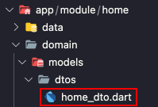

# Flutter Arch CLI

## Gerador de código para facilitar uma arquitetura limpa

Get Start:
```bash
dart pub global activate ft_cli
```

ou

```bash
dart pub global activate --source path ./RepositoryProject
```

### Overview

Para tornar mais fácil e intuitivo implementar a Arquitetura _Uncle Bob's Clean Architecture_. Esta CLI fornece a estrutura base, onde irá gerar dinamicamente as Classes conforme mostrado nos exemplos abaixo.


### Comandos:

Crie as variaveis configuraveis do seu projeto, gerando uma estrutura básica, onde ira gerar uma pasta .ft_cli

```bash
ft_cli init 
```

Gerando um novo módulo

```bash
ft_cli g layer lib/app/module/home
```
<details>
<summary>Result</summary>


</details>

--- 

```bash
# Generate Entity
ft_cli g entity lib/app/module/home Home
```
<details>
<summary>Result</summary>

```dart
// home.entitiy.dart 
class HomeEntity {

  HomeEntity();

}
```

</details>

--- 

```bash
# Generate UseCase
ft_cli g usecase lib/app/module/home GetHomeCards
```
<details>
<summary>Result</summary>

```dart
//get_home_cards.usecase.dart
abstract class GetHomeCardsUsecase {
  Future<void> call();
}
```
```dart
//get_home_cards_imp.usecase.dart
import 'get_home_cards_usecase.dart';

class GetHomeCardsImpUsecase implements GetHomeCardsUsecase {
  @override
  Future<void> call() {
    // TODO: implement call
    throw UnimplementedError();
  }
  
}
  
```

</details>

--- 

```bash 
# Generate Repository
ft_cli g repository lib/app/module/home GetHomeCards
```
<details>
<summary>Result</summary>

```dart
// domain/repositories/get_home_cards.repository.dart
abstract class GetHomeCardsRepository {
  Future<void> call();
}
```
```dart
// data/repositories/get_home_cards_imp.repository.dart
import '../../repositories/get_home_cards_repository.dart';

class GetHomeCardsImpRepository implements GetHomeCardsRepository {
  @override
  Future<void> call() {
    // TODO: implement call
    throw UnimplementedError();
  }
}
```

</details>

--- 

```bash
# Generate Dto
ft_cli g dto lib/app/module/home Home
```
<details>
<summary>Result</summary>

```dart
// home_dto.dart
import '../../models/entities/home_entity.dart';

class HomeDto extends HomeEntity {

  HomeDto() : super();

}
```

</details>

```bash
# Generate Page
ft_cli g page lib/app/module/home HomeCards
```

```bash
# Generate Controller
ft_cli g controller lib/app/module/home HomeCards
```

```bash

-------------------------- HELPS -------------------------- 

i, init             Gera os arquivos configuraveis do projeto...
g, gen              Geração de estruturade acordo com a opção page, datasoure, repository...
p, page             Cria uma nova pagina com um controller...
c, controller       Cria um novo controller...
d, datasource       Cria a camada de busca dados de fontes externas...
r, repository       Cria a camada para tratar os dados...
u, usecase          Cria a camada para tratar as regras de negócio...
e, entity           Cria as entidades...
dto                 Cria os dto para transferência de dados...

mf, microfrontend   Seleciona a opção para criação de novos componentes de microfrontend...

```
---
### Palavras reservadas

Reserved words can be used in the templet files that are generated in .ft_cli/templete the reserved words must be used inside mustaches `{{}}` example `{{name}}`, can also be used in reserved words an extension, example `{{name.pascalCase}}` whose extension will format the word as needed, you can check the lists below for all reserved words and extensions

Palavras reservadas podem ser usadas nos arquivos de modelo que são gerados em .ft_cli/templete as palavras reservadas devem ser usadas dentro de _mustaches_ `{{}}` exemplo `{{nome}}`, também podem ser usadas em palavras reservadas uma extensão, exemplo `{{name.pascalCase}}` cuja extensão formatará a palavra conforme necessário, você pode verificar as listas abaixo para todas as palavras reservadas e extensões

* `Palavras reservadas podem ser editadas em meu_projeto\.ft_cli\configs.json`

| Palavras reservadas               | `default`                                                                                            |
|------------------------------|-----------------------------------------------------------------------------------------------------------|
| name                         | Entrada pelo terminal, este valor é o último parâmetro da expressão para gerar os modelos                 |
| path                         | Entrada pelo terminal, caminho onde o novo arquivo será gerado                                            |
| module                       | input input by the terminal, name of the module that will generate the new files                          |
| projectName                  | Entrada do nome do projeto quando é criado um componente de microfrontend                                 |
| projectNameComplete          | O nome do projeto concatenado com o padrão do modelo dos microfrontend                                    |
| repositoryPathInterface      | domain/repositories                                                                                       |
| repositoryNameFileInterface  | {{name.snakeCase}}_repository                                                                             |
| repositoryPath               | data/repositories                                                                                         |
| repositoryNameFile           | {{name.snakeCase}}_imp_repository                                                                         |
| repositoryNameClassInterface | {{name.pascalCase}}Repository                                                                             |
| repositoryNameClass          | {{name.pascalCase}}ImpRepository                                                                          |
| datasourcePathInterface      | data/datasources                                                                                          |
| datasourceNameFileInterface  | {{name.snakeCase}}_datasource                                                                             |
| datasourcePath               | external/datasources                                                                                      |
| datasourceNameFile           | {{name.snakeCase}}_imp_datasource                                                                         |
| datasourceNameClassInterface | {{name.pascalCase}}Datasource                                                                             |
| datasourceNameClass          | {{name.pascalCase}}ImpDatasource                                                                          |
| usecasePathInterface         | domain/usecases                                                                                           |
| usecaseNameFileInterface     | {{name.snakeCase}}_usecase                                                                                |
| usecasePath                  | domain/usecases                                                                                           |
| usecaseNameFile              | {{name.snakeCase}}_imp_usecase                                                                            |
| usecaseNameClassInterface    | {{name.pascalCase}}Usecase                                                                                |
| usecaseNameClass             | {{name.pascalCase}}ImpUsecase                                                                             |
| pagePath                     | presentation/ui/pages/{{name.snakeCase}}                                                                  |
| pageNameFile                 | {{name.snakeCase}}_page                                                                                   |
| pageNameClass                | {{name.pascalCase}}Page                                                                                   |
| controllerPath               | presentation/ui/pages/{{name.snakeCase}}                                                                  |
| controllerNameFile           | {{name.snakeCase}}_controller                                                                             |
| controllerNameClass          | {{name.pascalCase}}Controller                                                                             |

### Extensions

| extension    | Exemple    |
|--------------|------------|
| camelCase    | testeCase  |
| constantCase | TESTE_CASE |
| sentenceCase | Teste case |
| snakeCase    | teste_case |
| dotCase      | teste.case |
| paramCase    | teste-case |
| pathCase     | teste/case |
| pascalCase   | TesteCase  |
| headerCase   | Teste-Case |
| titleCase    | Teste Case |

### Triggers

##### Replace

in .ft_cli/templete a {{term}}_replace_trigger.json file is generated where from your annotation it can apply a replace to any input expression, for example:

Em .ft_cli/templete, um arquivo {{term}}_replace_trigger.json é gerado onde, a partir de sua anotação, ele pode aplicar uma substituição a qualquer expressão de entrada, por exemplo:
```json
[
    {
        "pathFile": "{{path}}\\{{module}}_module.dart",
        "from": "//imports",
        "to": "//imports\nimport '{{controllerPath}}/{{controllerNameFile}}.dart';"
    },
    {
        "pathFile": "{{path}}\\{{module}}_module.dart",
        "from": "//Dependence",
        "to": "//Dependence\nfinal {{controllerNameClass.camelCase}} = {{controllerNameClass.pascalCase}};"
    }
]
```
Onde irá executar um _replace_ no arquivo apontado, a partir da expressão

##### Criar novo arquivo

in .ft_cli / templete, a file {{term}} _ new_file_trigger.json is generated where, from his annotation, he can create a new file with the pre-defined templete, for example:

Note, the ``generate`` variable must be ``true`` to generate the file.
em .ft_cli/templete, um arquivo {{term}}_new_file_trigger.json é gerado onde, a partir de sua anotação, ele pode criar um novo arquivo com o modelo predefinido, por exemplo:

Observe que a variável ``generate`` deve ser ``true`` para gerar o arquivo.

```json
[
    {
        "pathFile": "{{path}}\\{{module}}_module",
        "pathTemplete": ".ft_cli/template/layer/complete_new_file_exemple.template",
        "generate": true
    }
]
```

Templete

 ``.ft_cli/template/layer/complete_new_file_exemple.template``

```file
class {{module.pascalCase}}Module extends Module {
  @override
  final List<Bind> binds = [
    //Usercases

    //Repositories

    //Datasources
      
    //Controllers
  ];

  @override
  final List<ModularRoute> routes = [
    //Pages
  ];
}

```
Onde irá gerar um novo arquivo partir do templete definido.

##### Criar novo arquivo

Envie solicitações de recursos e bugs para melhorar a __CLI__ [relatar problemas](https://github.com/jheimes-silveira/ft_cli/issues).